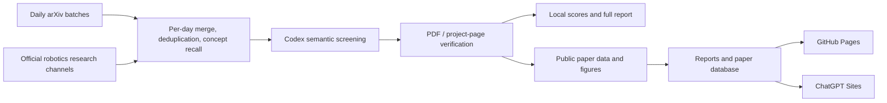

# Automated Paper Reader for Robotics

> [中文](README.md) | English

A paper-monitoring, full-text verification, and publishing system for embodied-intelligence and robot-learning researchers. It uses arXiv as the primary paper source, supplements it with official research channels from robotics organizations, asks Codex to perform semantic screening and source-grounded review, and publishes the results as paper reports, a searchable database, and a company tracker.

## Live Sites

- [GitHub Pages](https://kaijunwang111.github.io/Automated-Paper-Reader-for-Robotics/)
- [ChatGPT Sites](https://embodied-observatory.kaijunwang111.chatgpt.site)

Both sites use the same content and source code under `website/`; only their build and hosting targets differ.


## What the Project Does

Keyword alerts alone tend to mix relevant robotics research with off-topic, weakly evaluated, or marketing-led work. This repository turns literature tracking into an auditable pipeline:

1. Retrieve and deduplicate candidates per calendar day, keeping at most 200 papers per day without a second window-level cutoff.
2. Merge arXiv records with full papers found through tracked organizations' official channels, while preserving concept-level recall for manipulation, VLA/WAM/WM, touch, force, and human-video transfer.
3. Semantically screen each day's full candidate pool and open at most 10 full texts per day. Keyword-hit counts are not treated as a quality score.
4. Select at most five papers per day based on method, data, experiments, ablations, real-robot evidence, and reproducibility. Monday reports are capped at 15 and Friday reports at 20; fewer papers are published when the quality bar is not met.
5. Produce scan-friendly cards, a more detailed technical reading, and one or two original-paper method figures per selected paper.
6. Keep local audit information separate from the cleaned public website.

The Python scripts prepare candidates; they do not generate the final research conclusions. Final selection and writing require Codex to inspect the source paper.

## Pipeline



## Key Capabilities

### Retrieval and Selection

- arXiv is the primary source; OpenReview and OpenAlex fetchers remain available but are disabled by default.
- The production workflow also checks official research pages, project pages, GitHub, and Hugging Face for 24 tracked robotics organizations, allowing formal papers or technical reports that have not yet appeared on arXiv to enter the same candidate pool.
- Records are deduplicated by arXiv ID, normalized title, authors, and project URL before a 200-paper per-day cap is applied. Multi-day report windows are merged only after daily semantic screening.
- Keywords and concept aliases are recall signals, not additive quality scores. A tracked-organization match only provides bounded recall, full-text-review, and tie-break priors; it never increases the paper's evidence score.
- Negative terms and full-text rules exclude medical, surgical, mining, laboratory-automation, pure-navigation, and system-integration work that falls outside the current research scope.
- Scores are used only for local screening and auditing; they are not shown on the public website.
- Abstract-only candidates cannot enter a production report.

### Structured Paper Pages

Each public paper entry contains three information layers:

- Six overview cards: motivation, method, model architecture, data, experiments and conclusions, and improvements over the closest baselines.
- Three editorial cards: strengths, limitations, and transferable ideas.
- Three detailed sections: technical details, experiments and ablations, and reproducibility.

Project, code, model, and data links are included only when they can be verified through the paper or an official channel. Exact numbers, formulas, architectural details, and experimental settings should remain traceable to the source.

### Figure Quality Control

- Each selected paper uses one or two original Overview, Method, or Architecture figures.
- Preferred sources are standalone arXiv HTML figures, arXiv source assets, or official project-page images.
- Every report stores a figure manifest and a contact sheet for checking figure number, source, dimensions, completeness, and crop quality.
- Website tests enforce figure counts, minimum dimensions, manifest coverage, and resource availability.

### Searchable Paper Database

Papers are classified by their primary contribution rather than every technique mentioned in the text. Current dimensions include:

- Research: VLA, WAM, WM, representation learning, Memory, CoT, Subtask, and Other.
- Training and optimization: Pre-training, Post-training, BC, RL, and Test-time Adaptation.
- Novel modality: Depth / RGB-D, Point Cloud / 3D, Force / Torque, Tactile, Audio, Mask / Segmentation, State / Proprioception, and others.
- Data method: data quality and selection, augmentation, synthetic or simulated data, online data and human correction, UMI / Ego / Human Video, and cross-embodiment data.
- Robot platform: arm, humanoid, mobile base, dexterous hand, gripper, and combinations thereof.
- Deployment and transfer: real-robot deployment optimization, Sim2Real, Real2Sim, Real2Sim2Real, and cross-embodiment transfer.

The database can be searched by title, arXiv ID, institution, and classification.

### Company Tracker

The website checks 24 robotics companies or research organizations each week. Final links must come from an official website, technical blog, research page, investor material, or GitHub organization; media and search results are discovery aids only.

## Schedule

The default timezone is `Asia/Shanghai`:

| Branch | Schedule | Work performed |
| --- | --- | --- |
| Monday maintenance | Monday 09:30 | Previous Friday–Sunday papers plus the latest official company signals |
| Friday maintenance | Friday 09:30 | Monday–Thursday papers; company tracking is skipped |

Operational instructions live in [`automation/`](automation/README.md), and the production quality gates are documented in [`automation/PAPER_DAILY_QUALITY_GATES.md`](automation/PAPER_DAILY_QUALITY_GATES.md).

## Repository Layout

```text
Automated-Paper-Reader-for-Robotics/
├── .github/workflows/pages.yml          # GitHub Pages build and deployment
├── automation/                          # Codex schedules and quality gates
├── paper-daily/
│   ├── config.yaml                      # Research profile, sources, and limits
│   ├── scripts/                         # Retrieval, merge, dedupe, and ranking
│   ├── tests/                           # Python pipeline tests
│   └── reports/                         # Local full reports, ignored by default
├── website/
│   ├── app/                             # Website routes
│   ├── components/                      # UI components
│   ├── lib/                             # Reports, database, and company data
│   ├── public/report-assets/            # Original-paper figures
│   ├── quality/                         # Figure manifests and contact sheets
│   └── tests/                           # Sites and static-export tests
├── Paper_Reader.template.txt            # Chinese Codex template
├── Paper_Reader.template.en.txt         # English Codex template
├── LICENSE
└── NOTICE
```

## Quick Start

### Requirements

- Python 3.10 or newer
- Node.js 22.13 or newer
- A Codex environment capable of opening paper pages and PDFs for the full review and writing stages

### 1. Clone

```bash
git clone https://github.com/kaijunwang111/Automated-Paper-Reader-for-Robotics.git
cd Automated-Paper-Reader-for-Robotics
```

### 2. Install Retrieval Dependencies

Linux / macOS:

```bash
cd paper-daily
python -m venv .venv
source .venv/bin/activate
python -m pip install -r requirements.txt
```

Windows PowerShell:

```powershell
cd paper-daily
python -m venv .venv-win
.\.venv-win\Scripts\python.exe -m pip install -r requirements.txt
```

### 3. Build a One-Day Candidate Pool

```bash
python scripts/daily_papers.py \
  --config config.yaml \
  --date today \
  --stage fetch \
  --sources arxiv \
  --lookback-days 1 \
  --force
```

Main outputs:

```text
paper-daily/data/raw/YYYY-MM-DD.json
paper-daily/data/processed/YYYY-MM-DD_candidates.json
paper-daily/logs/YYYY-MM-DD.log
```

This command only builds the candidate pool; it does not generate a final report. Use `scripts/merge_candidates.py` for multi-day windows and follow [`automation/PAPER_DAILY_AUTOMATION.md`](automation/PAPER_DAILY_AUTOMATION.md) for the production review and publishing flow.

### 4. Run the Website Locally

```bash
cd ../website
npm ci
npm run dev
```

## Tests

Paper pipeline:

```bash
cd paper-daily
python -m pytest -q
```

ChatGPT Sites target:

```bash
cd website
npm test
```

GitHub Pages static-export target:

```bash
cd website
npm run test:pages
```

Lint:

```bash
cd website
npm run lint
```

## Dual-Site Publishing

`website/` is the single content source for both public sites:

| Target | Build | Deployment |
| --- | --- | --- |
| ChatGPT Sites | `vinext build` | Reuses the existing project in `website/.openai/hosting.json` |
| GitHub Pages | Next.js static export | Deployed by `.github/workflows/pages.yml` after a push to `main` |

GitHub Actions only builds and hosts the static website. It does not run paper retrieval and requires no OpenAI API key. A single local Codex automation now runs both schedules: Monday performs the paper and company phases sequentially, while Friday runs the paper phase only. It then tests, commits, and publishes once. GitHub Pages deploys the matching `main` commit, while ChatGPT Sites publishes the exact `website` source tree from that same commit. A run reports synchronization only after both public sites have been verified.

## Configuration and Privacy

- [`paper-daily/config.yaml`](paper-daily/config.yaml) contains the public research profile, positive and negative terms, sources, organization list, and candidate limits.
- `Paper_Reader.txt` contains machine-specific paths and private screening preferences and is ignored by Git; only templates are committed.
- `paper-daily/data/`, `paper-daily/logs/`, and local full reports are ignored by default.
- Local reports may retain scores, prompts, and execution details; the public website excludes them.
- Source requests ignore potentially broken automation proxy variables by default. Set `PAPER_DAILY_USE_ENV_PROXY=1` when the system proxy is required.

## Content Scope

This project is a research-monitoring aid, not a substitute for independent verification of the original paper, code, or experiments. Summaries can become outdated as papers are revised; use the linked paper and official project page for consequential research decisions.

## Upstream and License

This project builds on [Codex Automated Paper Reader](https://github.com/Jurio0304/Codex_Automated_Paper_Reader) by Jia Yao ([@Jurio0304](https://github.com/Jurio0304)) and preserves the upstream MIT license and copyright notice. This repository adds embodied-intelligence selection rules, production automation gates, a paper database, a company tracker, original-figure QA, and dual-site publishing.

Project code and original documentation are licensed under the [MIT License](LICENSE). Paper figures under `website/public/report-assets/` and other third-party materials are not covered by this project's MIT license; their rights remain with their respective authors, publishers, or owners. See [NOTICE](NOTICE) for attribution and scope details.
