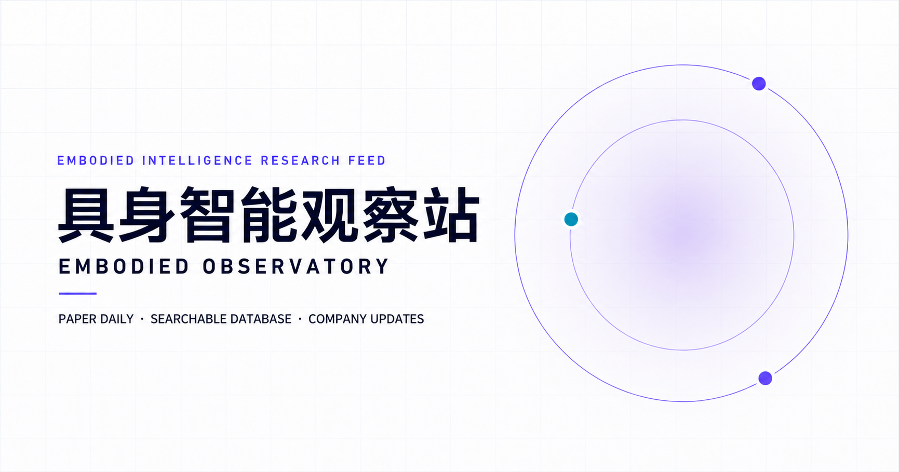
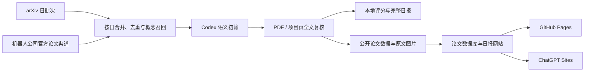

# Automated Paper Reader for Robotics

> 中文 | [English](README.en.md)

一个面向具身智能与机器人学习研究者的论文追踪、全文复核和公开发布系统。项目以 arXiv 为主要论文源，补充机器人公司官方研究渠道，通过 Codex 完成语义筛选、原文核验和结构化总结，并将结果同步到论文数据库、学术日报和公司动态网站。

## 在线站点

- [GitHub Pages](https://kaijunwang111.github.io/Automated-Paper-Reader-for-Robotics/)
- [ChatGPT Sites](https://embodied-observatory.kaijunwang111.chatgpt.site)

两个网站共用 `website/` 下的同一份内容和页面源码，仅构建与托管方式不同。



## 项目解决什么问题

机器人论文更新速度快，仅依赖关键词订阅很容易混入领域偏离、实验薄弱或只有营销材料支撑的工作。本项目把文献追踪拆成可审计的多阶段流程：

1. 按自然日抓取并去重，每天最多保留 200 篇候选论文；多日窗口不再做统一截断。
2. 合并 arXiv 与受关注机构的官方论文渠道，通过概念召回保留操作、VLA/WAM/WM、触觉、力觉和人类视频迁移等明显相关工作。
3. 对每天的完整候选池做语义初筛，再按天打开最多 10 篇正文；关键词命中数量不作为质量分。
4. 依据方法、数据、实验、消融、真机验证和可复现性，每天最多收录 5 篇；周一整期最多 15 篇、周五最多 20 篇，质量不足时允许少选。
5. 为每篇入选论文生成速览卡片、详细技术解读和 1–2 幅原论文方法图。
6. 将本地审计记录与公开内容分离，并把公开版本发布到网站。

Python 脚本负责构建候选池，不会直接生成最终论文结论；最终选择和总结需要 Codex 阅读原文后完成。

## 工作流



## 主要功能

### 论文检索与筛选

- 以 arXiv 为主要论文源，OpenReview 与 OpenAlex 抓取器保留但默认关闭。
- 检查配置中 24 个机器人公司或研究团队的官方研究页、项目页、GitHub 与 Hugging Face，补充尚未进入 arXiv 的正式论文或技术报告。
- 按 arXiv ID、规范化标题、作者和项目页去重；每个自然日最多保留 200 篇，完成逐日语义初筛后才合并日报窗口。
- 关键词与同义概念只负责降低漏检，不累计为论文质量分。受跟踪公司只提供有限的召回、全文复核和同等质量下的选择先验，不直接提高质量分。
- 使用负向关键词和全文规则排除医疗、手术、矿山、实验室自动化、纯导航及纯系统集成等偏离当前研究目标的论文。
- 评分仅用于内部筛选和本地排查，不在公开网站展示。
- 最终论文必须基于正文核验；只读到摘要的候选不会进入正式日报。

### 结构化论文内容

每篇公开论文由三层信息组成：

- 六张速览卡片：出发点、方法、模型结构、数据组成、实验内容和结论、相比 baseline 的改进点。
- 三张判断卡片：亮点、局限、可借鉴点。
- 三段详细正文：技术细节、实验和消融测试、可复现性。

项目页、代码、模型和数据链接仅在能够从论文或官方渠道确认时加入。论文中的精确数字、公式、模型结构与实验设置都应能追溯到原文。

### 论文图片质量控制

- 每篇论文使用 1–2 幅 Overview、Method 或 Architecture 原图。
- 优先使用 arXiv HTML 独立图片、arXiv source 原图或官方项目页图片。
- 每期保存 figure manifest 和 contact sheet，检查图号、来源、尺寸、完整性及裁切质量。
- 网站测试会校验图片数量、最小尺寸、质量清单和资源链接。

### 可检索论文数据库

数据库按照论文的主要贡献分类，而不是给正文中出现过的每项技术都打标签。当前维度包括：

- 研究方向：VLA、WAM、WM、表征学习、Memory、CoT、Subtask、其他。
- 训练与优化：Pre-training、Post-training、BC、RL、Test-time Adaptation。
- 创新模态：Depth / RGB-D、Point Cloud / 3D、Force / Torque、Tactile、Audio、Mask / Segmentation、State / Proprioception 等。
- 数据方法：数据质量与筛选、数据增强、合成或仿真数据、在线数据与人工纠正、UMI / Ego / Human Video、跨本体数据等。
- 机器人平台：机械臂、Humanoid、轮式底盘、灵巧手、夹爪及其组合。
- 部署与迁移：真机部署优化、Sim2Real、Real2Sim、Real2Sim2Real、跨本体迁移。

数据库支持按标题、arXiv ID、机构和分类进行检索。

### 公司动态追踪

网站每周检查一次 24 家国内外机器人公司或研究团队。最终引用只允许公司官网、官方技术博客、官方研究页、官方投资者材料或官方 GitHub；媒体与搜索结果只能用于发现线索。

## 更新计划

默认时区为 `Asia/Shanghai`：

| 任务分支 | 时间 | 执行内容 |
| --- | --- | --- |
| 周一维护 | 每周一 09:30 | 上周五至周日论文 + 公司最新官方信号 |
| 周五维护 | 每周五 09:30 | 本周一至周四论文；不执行公司追踪 |

完整运行手册位于 [`automation/`](automation/README.md)，论文质量门禁见 [`automation/PAPER_DAILY_QUALITY_GATES.md`](automation/PAPER_DAILY_QUALITY_GATES.md)。

## 项目结构

```text
Automated-Paper-Reader-for-Robotics/
├── .github/workflows/pages.yml          # GitHub Pages 构建与部署
├── automation/                          # Codex 定时任务与质量门禁
├── paper-daily/
│   ├── config.yaml                      # 检索画像、来源与候选上限
│   ├── scripts/                         # 抓取、合并、去重和粗排脚本
│   ├── tests/                           # Python 流程测试
│   └── reports/                         # 本地完整日报（默认不提交）
├── website/
│   ├── app/                             # 网站路由
│   ├── components/                      # 页面组件
│   ├── lib/                             # 日报、数据库与公司动态数据
│   ├── public/report-assets/            # 原论文方法图
│   ├── quality/                         # Figure manifest 与 contact sheet
│   └── tests/                           # Sites 与静态导出测试
├── Paper_Reader.template.txt            # 中文 Codex 模板
├── Paper_Reader.template.en.txt         # English Codex template
├── LICENSE
└── NOTICE
```

## 快速开始

### 环境要求

- Python 3.10 或更高版本
- Node.js 22.13 或更高版本
- 能够阅读论文页面与 PDF 的 Codex 环境，用于完成全文复核和最终写作

### 1. 克隆仓库

```bash
git clone https://github.com/kaijunwang111/Automated-Paper-Reader-for-Robotics.git
cd Automated-Paper-Reader-for-Robotics
```

### 2. 安装论文检索依赖

Linux / macOS：

```bash
cd paper-daily
python -m venv .venv
source .venv/bin/activate
python -m pip install -r requirements.txt
```

Windows PowerShell：

```powershell
cd paper-daily
python -m venv .venv-win
.\.venv-win\Scripts\python.exe -m pip install -r requirements.txt
```

### 3. 构建单日候选池

```bash
python scripts/daily_papers.py \
  --config config.yaml \
  --date today \
  --stage fetch \
  --sources arxiv \
  --lookback-days 1 \
  --force
```

主要输出：

```text
paper-daily/data/raw/YYYY-MM-DD.json
paper-daily/data/processed/YYYY-MM-DD_candidates.json
paper-daily/logs/YYYY-MM-DD.log
```

该命令只构建候选池，不会生成最终日报。多日窗口可使用 `scripts/merge_candidates.py` 合并，正式筛选和发布流程请遵循 [`automation/PAPER_DAILY_AUTOMATION.md`](automation/PAPER_DAILY_AUTOMATION.md)。

### 4. 本地运行网站

```bash
cd ../website
npm ci
npm run dev
```

## 测试

论文检索流程：

```bash
cd paper-daily
python -m pytest -q
```

ChatGPT Sites 目标：

```bash
cd website
npm test
```

GitHub Pages 静态导出目标：

```bash
cd website
npm run test:pages
```

代码检查：

```bash
cd website
npm run lint
```

## 双站点发布

`website/` 是两个站点唯一的内容来源：

| 目标 | 构建方式 | 发布方式 |
| --- | --- | --- |
| ChatGPT Sites | `vinext build` | 复用 `website/.openai/hosting.json` 中的现有 Sites 项目 |
| GitHub Pages | Next.js static export | 推送 `main` 后由 `.github/workflows/pages.yml` 部署 |

GitHub Actions 只负责静态网站构建和 Pages 托管，不运行论文检索，也不需要 OpenAI API Key。当前使用一个本地 Codex 自动化：周一顺序完成论文与公司阶段，周五只执行论文阶段，然后统一测试、提交并发布一次。GitHub Pages 由 `main` 上对应提交触发，ChatGPT Sites 使用同一提交下的精确 `website` 源码树发布；任务只有在两个公开站点均完成验证后才会报告同步成功。

## 配置与隐私

- [`paper-daily/config.yaml`](paper-daily/config.yaml) 保存公开的研究画像、正负关键词、来源、机构名单和候选上限。
- `Paper_Reader.txt` 用于机器路径和个人筛选偏好，已被 Git 忽略；公开仓库只提供模板。
- `paper-daily/data/`、`paper-daily/logs/` 和本地完整日报默认不提交。
- 本地日报可以保留评分、Prompt 和运行信息，公开网站会删除这些内部内容。
- 网络请求默认忽略自动化环境中可能失效的代理变量；需要使用系统代理时设置 `PAPER_DAILY_USE_ENV_PROXY=1`。

## 内容边界

本项目用于研究信息跟踪，不替代对原论文、代码和实验的独立核验。论文总结可能随论文版本更新而过时；重要结论请以链接到的原始论文和官方项目页为准。

## 上游与许可证

本项目基于 Jia Yao（[@Jurio0304](https://github.com/Jurio0304)）的 [Codex Automated Paper Reader](https://github.com/Jurio0304/Codex_Automated_Paper_Reader) 继续开发，并保留原项目的 MIT License 与版权声明。当前仓库新增了具身智能筛选体系、正式自动化门禁、论文数据库、公司追踪、原文图片 QA 和双站点发布等功能。

项目代码及原创文档采用 [MIT License](LICENSE)。`website/public/report-assets/` 中引用的论文图片及其他第三方材料不属于本项目的 MIT 授权范围，其权利归各自作者、出版方或权利人所有；再次使用前请查阅对应原文及其许可。详细归属见 [NOTICE](NOTICE)。
